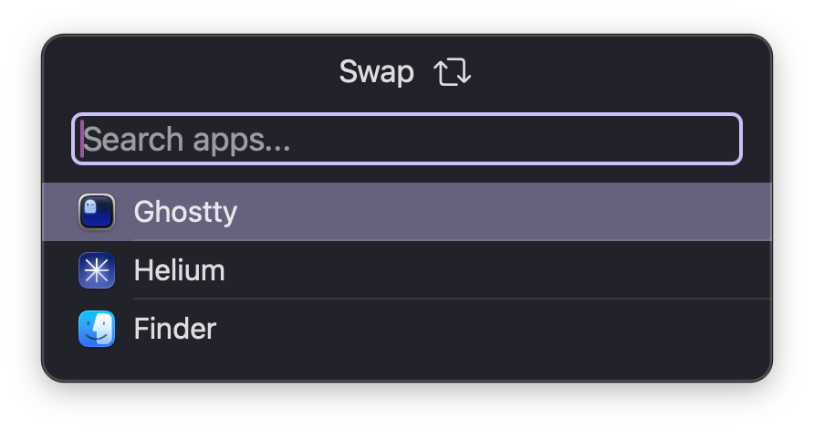
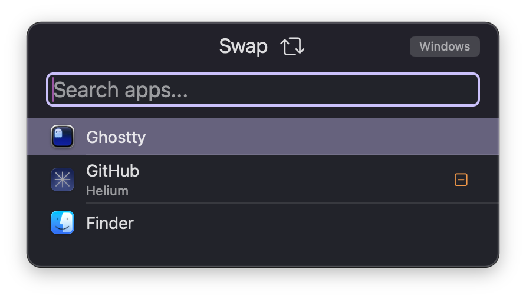

# Swap

Swap is a macOS application that allows you to quickly switch between open
windows and applications. This project is inspired by the
[FastForward](https://github.com/gaauwe/fast-forward) project as well as the
Raycast Window Switcher extension.

## Screenshots

<details>


</details>

# Usage

The best way to use Swap is to build it from source.

The app can be used as-is out of the box, but there are also some configuration
options.

Example config file:

```
# Accent color
color=#CDC1FF
# Mode to use for selection; can be either "toggle" or "hold"
mode=toggle
```

# Build from source

## Requirements

- Zig 0.15.2
- Xcode 26

You can build the application by running the `./build.sh` script. Additionally,
you can run `zig build` and then build the app in Xcode.
